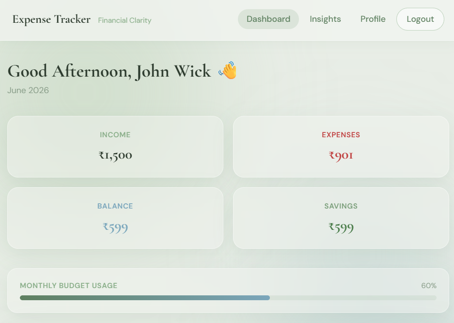
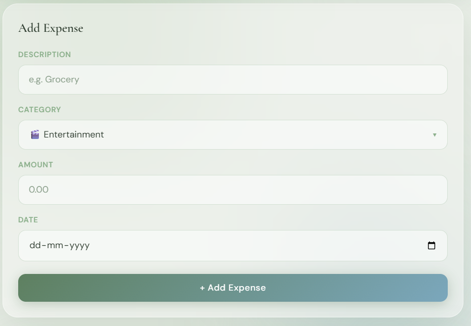
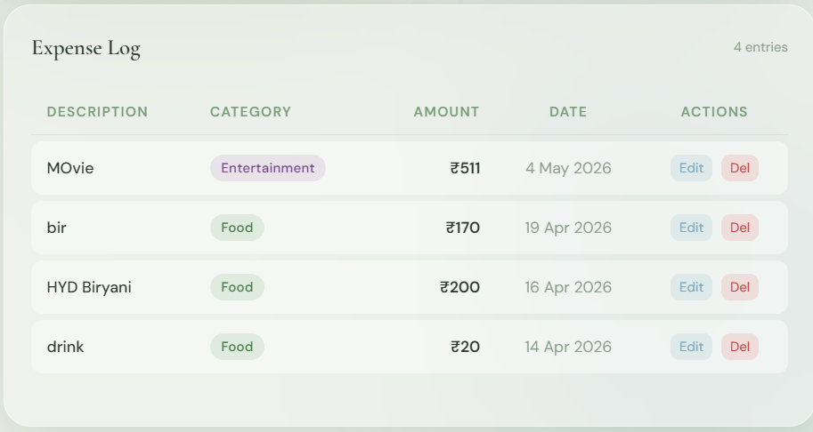
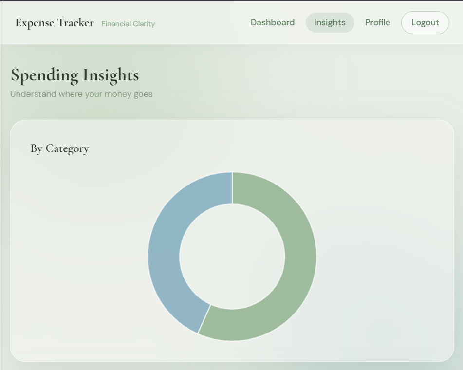
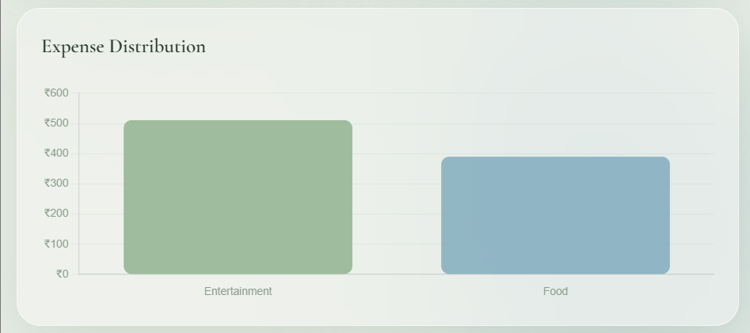

# Expense Tracker

A modern personal finance management web application built using Firebase, Firestore, Chart.js, and GitHub Pages. The application enables users to track expenses, monitor spending patterns, analyze financial data, and manage budgets through an intuitive and responsive interface.

## Live Demo

https://pranav-debug09.github.io/expense-tracker/

---

## Overview

Expense Tracker is a web-based application designed to simplify personal financial management. Users can securely manage their income and expenses, gain insights into spending behavior, and monitor financial performance through interactive analytics and visualizations.

---

## Key Features

### Authentication
- Firebase Authentication
- Secure user registration and login
- Persistent user sessions

### Expense Management
- Create expense records
- Edit expenses
- Delete expenses
- Categorize transactions
- Date-based expense tracking

### Financial Dashboard
- Income monitoring
- Expense tracking
- Real-time balance calculation
- Savings tracking
- Budget utilization monitoring
- Overspending alerts

### Analytics and Insights
- Category-wise expense distribution
- Interactive doughnut charts
- Comparative bar charts
- Highest spending category identification
- Average daily spending analysis

### Profile Management
- User profile configuration
- Income management
- Currency selection
- Previous month financial data tracking

### User Experience
- Responsive design
- Mobile-friendly interface
- Modern glassmorphism-inspired UI
- Interactive data visualization

---

## Screenshots

### Dashboard



### Expense Entry



### Expense Log



### Spending Insights



### Category Analysis


### User Profile



---

## Technology Stack

### Frontend
- HTML5
- CSS3
- JavaScript (ES6+)
- Tailwind CSS

### Backend
- Firebase Authentication
- Cloud Firestore

### Data Visualization
- Chart.js

### Hosting
- GitHub Pages

---

## Architecture

```text
Client (GitHub Pages)
        │
        ▼
Frontend Application
(HTML, CSS, JavaScript)
        │
        ▼
Firebase Authentication
        │
        ▼
Cloud Firestore Database
```

---

## Project Structure

```text
expense-tracker/
│
├── README.md
├── index.html
└── screenshots/
    ├── dashboard.png
    ├── add-expense.png
    ├── expense-log.png
    ├── insights.png
    ├── category-breakdown.png
    └── profile.png
```

---

## Security

User authentication and data storage are managed through Firebase services. Access to user-specific data should be restricted using Firestore security rules.

Recommended Firestore Rules:

```javascript
rules_version = '2';

service cloud.firestore {
  match /databases/{database}/documents {
    match /users/{userId} {
      allow read, write:
      if request.auth != null
      && request.auth.uid == userId;
    }
  }
}
```

---

## Future Enhancements

- Dark mode support
- CSV export functionality
- PDF report generation
- Budget goal management
- Advanced filtering and search
- Recurring expense tracking
- Progressive Web App (PWA) support
- Multi-month financial analytics

---

## Deployment

The application is hosted on GitHub Pages and uses Firebase Authentication and Cloud Firestore as backend services.

### Clone Repository

```bash
git clone https://github.com/Pranav-debug09/expense-tracker.git
```

### Open Locally

Simply open `index.html` in a browser or deploy using GitHub Pages.

---

## Author

**Pranav**

GitHub: https://github.com/Pranav-debug09

---

## License

This project is released under the MIT License.
